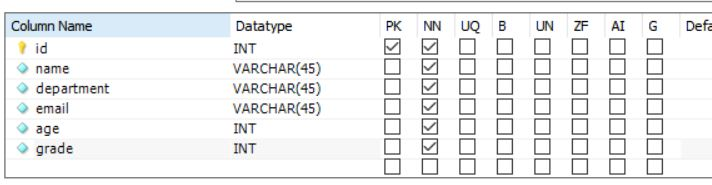
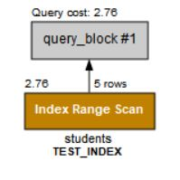
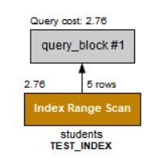
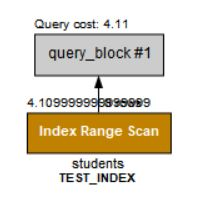
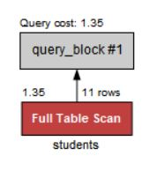
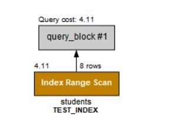
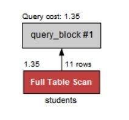
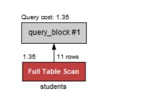

## 복합 인덱스 경우에 따라 타는지 궁금?

3개 컬럼 이상을 복합 인덱스를 설정했을 때 쿼리문 Case(경우)에 따라 인덱스를 타는지 안 타는지 궁금해서 실제로 직접 해보면서 확인 해보려고 합니다.

## TEST할 간단한 테이블 & 복합 인덱스

| Column Name | 설명                  |
| ----------- | --------------------- |
| id          | 학생 id (primary key) |
| name        | 학생 이름             |
| department  | 학과                  |
| email       | 이메일                |
| age         | 나이                  |
| grade       | 학년                  |

간단히 테스트할 예시로 학생 테이블이 있고, (department, age, grade)로 복합 인덱스를 설정하였다.

.JPG>)

## Case에 따라 인덱스 타는지 확인

WHERE 문에 복합 인덱스에 설정한 컬럼들의 조합을 하나씩 실행해보면서 EXPLAIN 확인해보았다.

### 1. WHERE문에 department, age, grade 있는 경우

```SQL
SELECT * FROM index_test.students
WHERE department IN ('Mathematics', 'Computer Engineering') AND age > 22 AND grade < 3;
```



index 타는 것 확인!!

### 2. WHERE문에 department, age 있는 경우

```SQL
SELECT * FROM index_test.students
WHERE department IN ('Mathematics', 'Computer Engineering') AND age > 22;
```



index 타는 것 확인!!

### 3. WHERE문에 department, grade 있는 경우

```SQL
SELECT * FROM index_test.students
WHERE department IN ('Mathematics', 'Computer Engineering') AND grade < 3;
```



index 타는 것 확인!!

### 4. WHERE문에 age, grade 있는 경우

```SQL
SELECT * FROM index_test.students
WHERE age > 22 AND grade < 3;
```



index 타지 않는 것 확인!!

### 5. WHERE문에 department 있는 경우

```SQL
SELECT * FROM index_test.students
WHERE department IN ('Mathematics', 'Computer Engineering');
```



index 타는 것 확인!!

### 6. WHERE문에 age 있는 경우

```SQL
SELECT * FROM index_test.students
WHERE age > 22;
```



index 타지 않는 것 확인!!

### 7. WHERE문에 grade 있는 경우

```SQL
SELECT * FROM index_test.students
WHERE grade < 3;
```



index 타지 않는 것 확인!!

## 왜 이런 결과가 나올까?

### 인덱스에 대해서

인덱스란 추가적인 저장 공간을 활용하여 DB 테이블의 검색 속도를 향상시키기 위한 자료구조 입니다.

## 복합인덱스 컬럼 선정 순서의 중요성

복함인덱스를 생성할 때, 컬럼 순서에 따라 완전히 다른 인덱스가 되며 성능차이도 천차만별이 됩니다. 그래서 복합인덱스 구성시 선택성이 좋은 컬럼을 앞으로 구성하는 것이 좋습니다.

컬럼순서에 따라 완전히 다른 인덱스가되며 성능차이도 천차만별이다.
컬럼순서는 복합인덱스 구성의 가장 중요한 요소
쿼리성능 테스트에는 항상 버퍼캐시를 비우고 실행해본다.
