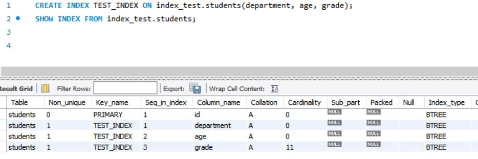
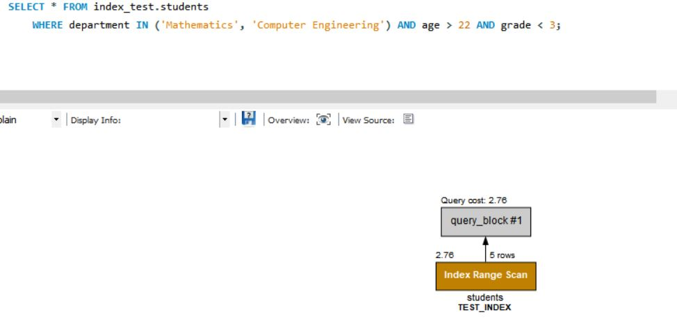
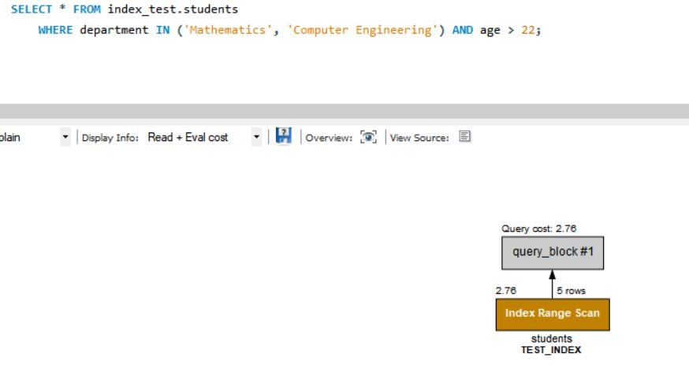
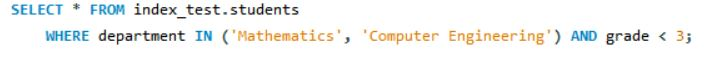
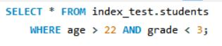
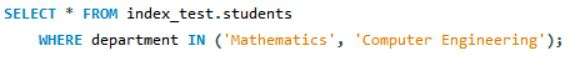
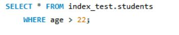
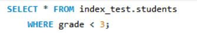

## 복합 인덱스 경우에 따라 타는지 궁금?

3개 컬럼 이상을 복합 인덱스를 설정했을 때 쿼리문 Case(경우)에 따라 인덱스를 타는지 안 타는지 궁금해서 실제로 직접 해보면서 확인 해보려고 한다.

## TEST할 간단한 테이블 & 복합 인덱스

| Column Name | 설명                  |
| ----------- | --------------------- |
| id          | 학생 id (primary key) |
| name        | 학생 이름             |
| department  | 학과                  |
| email       | 이메일                |
| age         | 나이                  |
| grade       | 학년                  |

간단히 테스트할 예시로 학생 테이블이 있고, (department, age, grade)로 복합 인덱스를 설정하였다.

## Case에 따라 인덱스 타는지 확인

WHERE 문에 복합 인덱스에 설정한 컬럼들의 조합을 하나씩 실행해보면서 EXPLAIN 확인해보았다.

### 1. WHERE문에 department, age, grade 있는 경우

index 타는 것 확인!!

### 2. WHERE문에 department, age 있는 경우

index 타는 것 확인!!

### 3. WHERE문에 department, grade 있는 경우

index 타는 것 확인!!

### 4. WHERE문에 age, grade 있는 경우

index 타지 않는 것 확인!!

### 5. WHERE문에 department 있는 경우

index 타는 것 확인!!

### 6. WHERE문에 age 있는 경우

index 타지 않는 것 확인!!

### 7. WHERE문에 grade 있는 경우

index 타지 않는 것 확인!!
