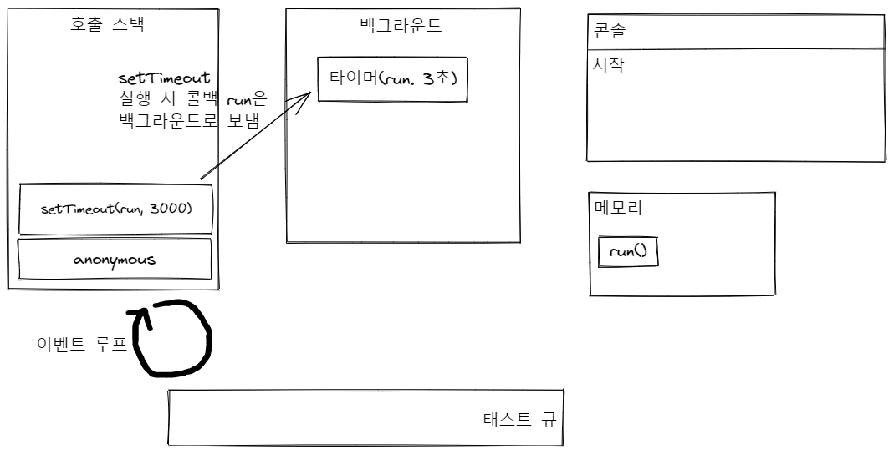
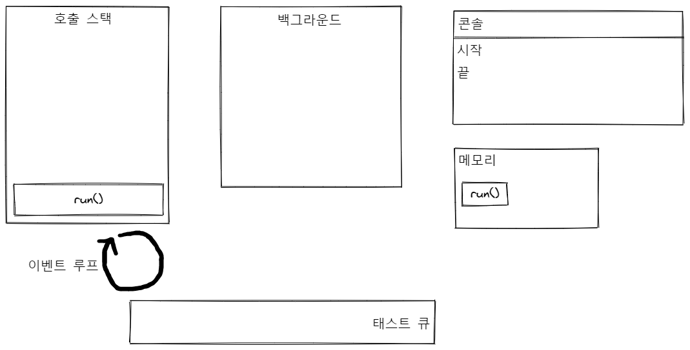
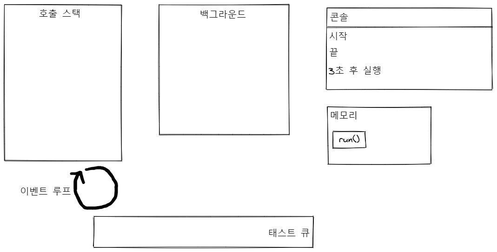

# 이벤트 기반

이벤트 기반(event-driven)이란 이벤트가 발생할 때 미리 지정해둔 작업을 수행하는 방식을 의미합니다. 이벤트 기반 시스템에서는 특정 이벤트가 발생할 때 무엇을 할지 미리 등록해두어야 합니다. 이를 이벤트 리스너(event listener)에 콜백(callback) 함수를 등록한다고 표현합니다. 노드도 이벤트 기반 방식으로 동작하므로. 이벤트가 발생하면 이벤트 리스너에 등록해둔 콜백 함수를 호출합니다. 발생한 이벤트가 없거나 발생했던 이벤트를 다 처리하면. 노드는 다음 이벤트가 발생할 때까지 대기합니다.


노드가 자바스크립트 코드와 함께 실행되는 내부 과정을 알아보겠습니다.

먼저 이벤트 루프(event loop), 태스크 큐(task queue), 백드라운드(background)에 대해서 알아보겠습니다.

- 이벤트 루프: 이벤트 발생 시 호출할 콜백 함수들을 관리하고, 호출된 콜백 함수의 실행 순서를 결정하는 역할을 담당합니다. 노드가 종료될 때 까지 이벤트 처리를 위한 작업을 반복합니다.
- 백그라운드: setTimeout 같은 타이머나 이벤트 리스너들이 대기하는 곳입니다. 자바스크립트가 아닌 다른 언어로 작성된 프로그램이라고 봐도 됩니다. 여러 작업이 동시에 실행될 수 있습니다.
- 태스크 큐: 이벤트 발생 후, 백그라운드에서는 태스크 큐로 타이머나 이벤트 리스너의 콜백 함수를 보냅니다. 보통 콜백들은 완료된 순서대로 줄을 서 있지만 특정한 경우에는 순서가 바뀌기도 합니다.

```jsx
// 노드가 실행시킬 자바스크립트 코드
function run() {
  console.log('3초 후 실행');
}
console.log('시작');
setTimeout(run. 3000);
console.log('끝');
```

실행 결과

```bash
시작
끝
3초 후 실행
```

노드는 자바스크립트 코드의 맨 위부터 한 줄씩 실행합니다. 함수 호출 부분을 발견했다면 호출한 함수를 호출 스택(call stack)에 넣습니다.

1. **파일을 실행하면 먼저 `anonymous`가 호출 스택에 들어갑니다.**

   ```jsx
   👉
   function run() {
     console.log('3초 후 실행');
   }
   console.log('시작');
   setTimeout(run. 3000);
   console.log('끝');
   ```

   

   **`anonymous` 함수는 처음 실행 시의 전역 컨텍스트(global context)를 의미합니다.**

2. 메모리에 `run` 이 선언됩니다.

   ```jsx
   👉function run() {
     console.log('3초 후 실행');
   }
   console.log('시작');
   setTimeout(run. 3000);
   console.log('끝');
   ```

   

3. `console.log('시작')`이 호출됩니다.

   ```jsx
   function run() {
     console.log('3초 후 실행');
   }
   👉console.log('시작');
   setTimeout(run. 3000);
   console.log('끝');
   ```

   

   `console.log('시작')`이 호출하면서 콘솔에 `시작`이 출력되고, `concole.log` 함수의 역할이 끝나면 호출 스택에서 빠집니다.

4. `setTimeout(run. 3000)`이 호출됩니다.

   ```jsx
   function run() {
     console.log('3초 후 실행');
   }
   console.log('시작');
   👉setTimeout(run. 3000);
   console.log('끝');
   ```

   

   `setTimeout`이 실행되면 타이머와 함께 `run` 콜백을 백그라운드로 보내고, `setTimeout`은 호출 스택에서 빠집니다.

5. `console.log('끝')`이 호출됩니다.

   ```jsx
   function run() {
     console.log('3초 후 실행');
   }
   console.log('시작');
   setTimeout(run. 3000);
   👉console.log('끝');
   ```

   

   `console.log('끝')`이 호출하면서 콘솔에 `끝`이 출력되고, `concole.log` 함수의 역할이 끝나면 호출 스택에서 빠집니다.

6. **파일이 끝나면 `anonymous`가 호출 스택에서 빠집니다.**

   ```jsx
   function run() {
     console.log('3초 후 실행');
   }
   console.log('시작');
   setTimeout(run. 3000);
   console.log('끝');
   👉
   ```

   

7. 백그라운드에서는 작업이 완료되면 태스크 큐로 보냅니다.

   

   백그라운드에서 3초를 센 후 `run` 함수를 태스크 큐로 보냅니다. 그림에서는 태스크 큐가 하나의 큐처럼 그렸지만 **실제로는 여러 개의 큐로 이루어져 있습니다.**

8. 이벤트 루프는 호출 스택이 비어 있으면 태스크 큐에서 함수를 하나씩 가져와 호출 스택에 넣습니다.

   

   호출 스택으로 올려진 `run`은 실행됩니다.

9. `console.log('3초 후 실행')`이 호출됩니다.

   ```jsx
   function run() {
     👉console.log('3초 후 실행');
   }
   console.log('시작');
   setTimeout(run. 3000);
   console.log('끝');
   ```

   

   `console.log('3초 후 실행')`이 호출하면서 콘솔에 `3초 후 실행`이 출력되고, `concole.log` 함수의 역할이 끝나면 호출 스택에서 빠집니다.

10. `run` 함수가 실행 완료 후 호출 스택에서 비워집니다.

    ```jsx
    function run() {
      console.log('3초 후 실행');
    👉}
    console.log('시작');
    setTimeout(run. 3000);
    console.log('끝');
    ```

    

    호출 스택, 백그라운드, 태스트 큐가 다 비워있으면 자바스크립트 실행이 완료된 것입니다.

**이벤트 루프는 호출 스택이 비어 있을 때만 태스크 큐에 있는 콜백 함수들을 호출 스택으로 가져오기 때문에** 만약 호출 스택에 함수들이 너무 많으면 **`setTimeout`의 콜백이 정확한 시간에 실행되지 않을 수 있습니다.**
