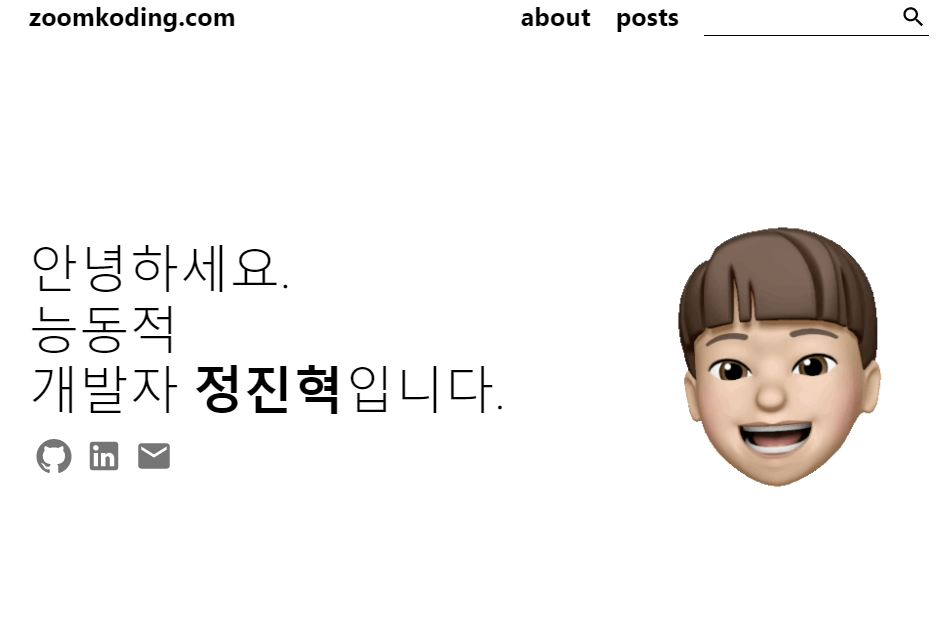
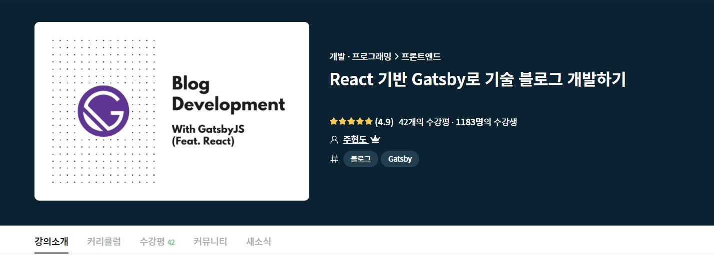
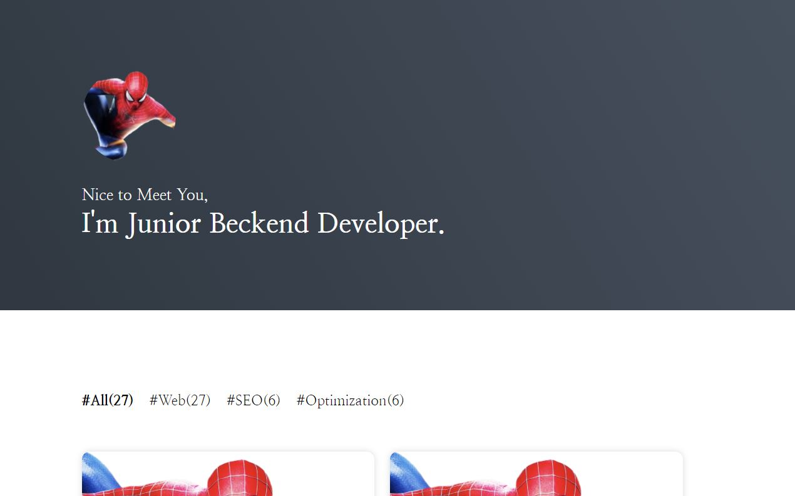

## 개발 블로그 시작

개발 블로그를 시작하고 싶어서 이것 저것 찾아보다가 처음에는

[zoomkoding](https://github.com/zoomkoding)님의 github 블로그 템플릿을 사용하게 되었다.

https://github.com/zoomkoding/zoomkoding-gatsby-blog

zoomkoding님의 github 블로그 템플릿은 [JaeYeopHan](https://github.com/JaeYeopHan)님의 https://github.com/JaeYeopHan/gatsby-starter-bee 테마와 비슷하면서 자신만의 특유한 움직이는 미모티콘이 인상적이었다.

그런데 내가 원하는 테마가 아니라 금방 싫증이 나버렸다.

그러다 우연히 인프런에 [ji5485](https://github.com/ji5485)님의 **React 기반 Gatsby로 기술 블로그 개발하기** 강의를 알게 되었다. [https://inf.run/4t53](https://inf.run/4t53)

강의가 **무료**인 데다가 React 기반 Gatsby로 개발, 블로그 디자인도 개인적으로 다른 블로그 테마보다 좋아서 수강하였다.

수강 후기: 강의는 영상 강의가 아닌 텍스트 강의로 진행하는 데 나쁘지 않았고 오히려 텍스트로 진행하다 보니 바로바로 접근하기도 편했고, 꼼꼼하게 설명되어 있어서 따라 만들기만 하면 된다. 👍

그래서 완성한 블로그 😄!!

블로그 디자인도 마음에 들고 React와 GraphQL 기술만 익히면 원하는 대로 커스터마이징도 가능하다!!

아무튼 기술 블로그도 만들었으니, 개발하면서 공부하거나 알게 된 것을 기록하기로 마음먹었지만, 꾸준히 할 수 있을지 모르겠다.

왜냐하면, 난 너무 게으르고 글 쓰는 능력도 꽝이기 때문이다.🤣🤣🤣

## 마무리

아무튼 개발 블로그 시작이요.
